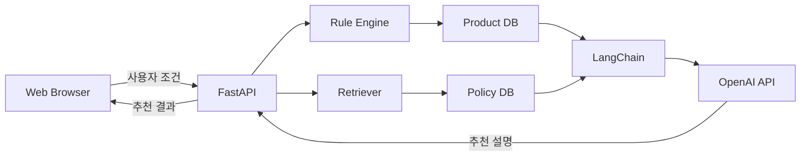

# AI 기반 주택담보대출 상품 추천 챗봇

사용자의 소득, 주택 가격, 대출 목적 등 조건을 바탕으로 적합한 주택담보대출 상품을 추천하고, 관련 약관과 정책을 근거로 추천 이유를 설명하는 AI 상담 서비스입니다.

규칙 기반 필터링과 스코어링으로 추천 상품을 결정하고, LLM은 검색된 금융 정보를 바탕으로 결과를 설명하도록 구성했습니다.

## 프로젝트 개요

주택담보대출 상품은 은행별 조건이 복잡하고 정책과 규제가 자주 변경됩니다. 사용자가 여러 상품과 약관을 직접 비교해야 하며, 상담 과정에서 개인정보 제공이나 신용조회가 요구될 수 있다는 부담도 있습니다.

본 프로젝트는 신용조회 없이 사용자가 입력한 조건만으로 대출 상품을 탐색하고, 추천 결과와 관련 근거를 대화형으로 확인할 수 있도록 기획했습니다.

* 개발 기간: 2025.11.03 ~ 2025.11.28
* 개발 인원: 6명
* 담당 역할: Backend
* 주요 기술: FastAPI, LangChain, OpenAI API, SQLite

## 주요 기능

### 사용자 조건 기반 상품 추천

사용자가 입력한 소득, 주택 가격, 대출 목적, 상환 조건 등을 바탕으로 신청 가능한 상품을 선별합니다.

### 규칙 기반 필터링 및 스코어링

상품별 필수 자격요건을 충족하지 못한 상품을 우선 제외한 뒤, 금리와 한도 등의 기준에 따라 적합도 점수를 계산합니다.

| 평가 기준     | 가중치 |
| --------- | --: |
| 금리 경쟁력    | 50% |
| 대출 한도 여유  | 20% |
| 금리 유형 적합도 | 15% |
| 상환 기간 적합도 | 15% |

### 근거 기반 추천 설명

약관 및 정책 문서에서 사용자 질문과 관련된 정보를 검색하고, 검색 결과를 LLM의 Context로 전달해 추천 이유와 유의사항을 생성합니다.

### 후속 상담

추천 결과에 관한 추가 질문을 입력하면 상품 정보와 약관·정책 데이터를 바탕으로 답변을 제공합니다.

## 시스템 구조



1. 사용자가 대출 조건을 입력합니다.
2. FastAPI 서버가 입력값을 검증하고 추천 엔진을 호출합니다.
3. Rule Engine이 자격요건을 기준으로 상품을 필터링합니다.
4. Scoring Model이 상품별 적합도 점수를 계산합니다.
5. 관련 상품·약관·정책 정보를 검색합니다.
6. 검색 결과를 LLM의 Context로 전달해 추천 근거를 생성합니다.
7. 추천 상품과 설명을 사용자에게 반환합니다.

## 추천 프로세스

### 1. Rule Filtering

정책 및 상품별 필수 조건을 기준으로 신청이 어려운 상품을 제외합니다.

* 사용자 연령
* 연 소득
* 주택 가격
* 대출 목적
* 생애 최초 주택 구입 여부
* 신혼부부 여부
* 정책상품별 자격요건

### 2. Product Scoring

필터링을 통과한 상품을 대상으로 적합도 점수를 계산하고 추천 순위를 결정합니다.

```text
Score =
    금리 경쟁력 × 0.50
  + 대출 한도 여유 × 0.20
  + 금리 유형 적합도 × 0.15
  + 상환 기간 적합도 × 0.15
```

### 3. Recommendation Explanation

추천 결과와 관련된 상품 정보, 약관 및 정책 내용을 LLM에 제공하여 사용자가 이해하기 쉬운 설명을 생성합니다.

## 기술 스택

| 구분            | 기술                    |
| ------------- | --------------------- |
| Backend       | Python, FastAPI       |
| LLM           | OpenAI API, GPT-4o    |
| LLM Framework | LangChain             |
| Retrieval     | TF-IDF, scikit-learn  |
| Database      | SQLite                |
| Frontend      | HTML, CSS, JavaScript |
| Collaboration | Git, GitHub           |

## 담당 역할

백엔드 개발을 담당하여 사용자 요청부터 추천 결과 반환까지의 서비스 흐름을 구현했습니다.

* FastAPI 기반 추천 및 상담 API 구현
* 사용자 입력값 검증과 응답 데이터 구조 설계
* 규칙 기반 추천 엔진과 API 서버 연동
* 상품·약관·정책 데이터 조회 로직 연결
* LangChain 기반 검색 및 LLM 응답 흐름 구현
* 프론트엔드와 백엔드 API 통합

## 데이터 구성

추천 정확성과 데이터 관리의 편의성을 위해 데이터를 용도에 따라 분리했습니다.

* `Product DB`: 은행별 주택담보대출 상품 정보 및 추천 조건
* `Policy DB`: 대출 관련 약관, 정책, 규제 및 자격요건

약관 및 정책 문서는 문서 구조에 따라 분할하고, TF-IDF 기반 검색을 통해 사용자 질문과 관련된 내용을 선별합니다.

## 실행 방법

### 1. Repository Clone

```bash
git clone <!-- 저장소 URL -->
cd <!-- 프로젝트 폴더명 -->
```

### 2. Package Installation

```bash
pip install -r requirements.txt
```

### 3. Environment Variables

프로젝트 루트에 `.env` 파일을 생성하고 OpenAI API Key를 입력합니다.

```env
OPENAI_API_KEY=your_api_key
```

### 4. Server 실행

```bash
uvicorn main:app --reload
```

실행 후 아래 주소에서 API 문서를 확인할 수 있습니다.

```text
http://localhost:8000/docs
```

> 실제 실행 파일의 위치에 따라 `main:app` 경로가 달라질 수 있습니다.

## 프로젝트 구조

```text
.
├── app/
│   ├── api/               # API Endpoint
│   ├── services/          # 추천 및 LLM 서비스
│   ├── recommendation/    # 필터링·스코어링 로직
│   ├── retrieval/         # 약관·정책 검색
│   ├── models/            # 요청·응답 데이터 모델
│   └── database/          # 상품·정책 DB 접근
├── data/                  # 상품 및 문서 데이터
├── frontend/              # 사용자 인터페이스
├── requirements.txt
└── README.md
```

> 위 구조는 README 작성을 위한 예시이며 실제 저장소 구조에 맞게 수정해야 합니다.

## 서비스 화면

<!-- 실제 서비스 화면 또는 GIF 추가 -->

* 사용자 조건 입력
* 추천 상품 목록
* 상품별 추천 근거
* 약관 및 정책 기반 후속 상담

## 한계 및 개선 방향

* 정형화되지 않은 금융 데이터를 자동으로 정제하는 파이프라인 구축
* 정책 및 상품 정보의 정기적인 갱신 기능 추가
* 추천 규칙과 가중치의 객관적인 평가 체계 마련
* 복합적인 예외 상황을 처리할 수 있도록 상담 시나리오 확장
* 사용자 피드백을 활용한 추천 기준 개선

## 유의사항

본 서비스는 학습 목적으로 개발한 프로토타입입니다. 제공되는 추천 결과는 실제 금융 상담이나 대출 심사를 대체하지 않으며, 정확한 상품 조건은 해당 금융기관을 통해 확인해야 합니다.
